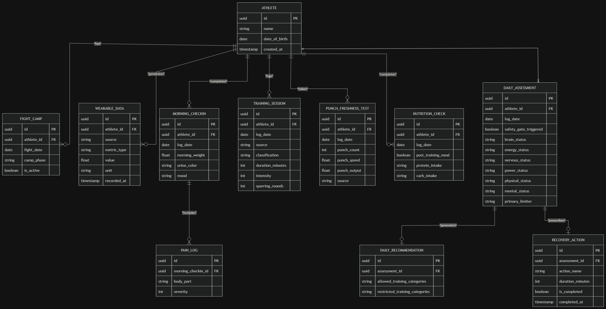
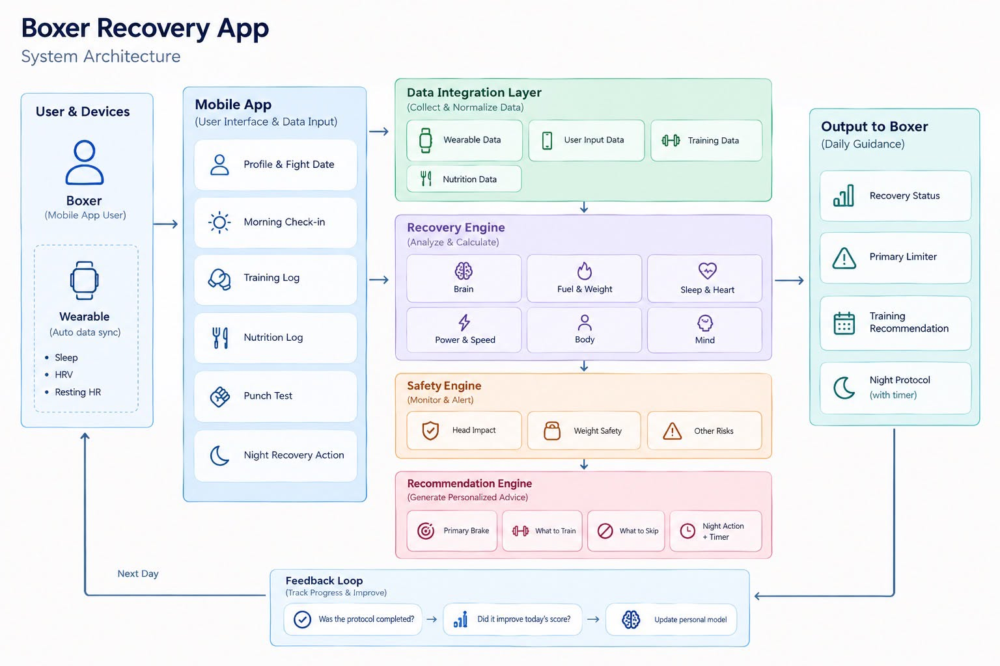
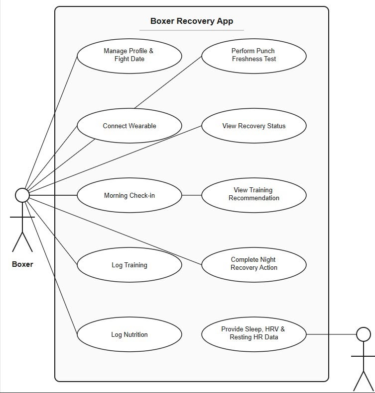
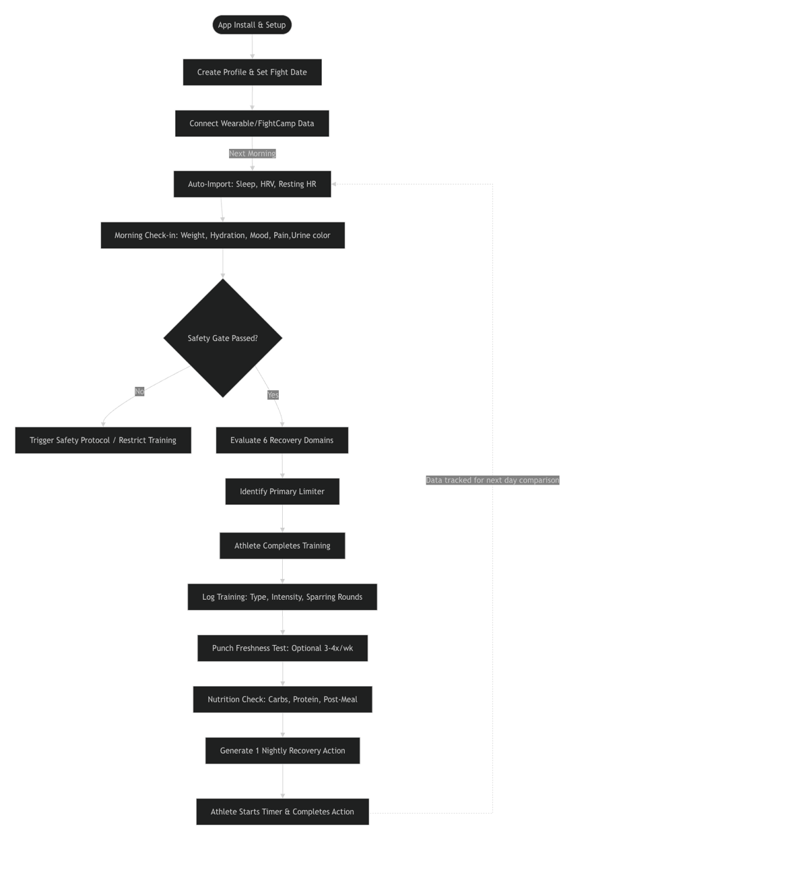

# User Journey — Recovery App for Boxers

**Primary persona:** professional boxer, 24–33, 6–15 fights in, no full-time performance staff. Owns a watch and a scale. Trains 9–12 sessions a week in camp. Has abandoned two fitness apps already.

**Secondary readers:** none. There is no coach seat in v1, and the journey is designed on the assumption that nobody else ever sees the inputs. That assumption is what makes honest soreness and mood entries possible.

---

## Figma Interactive Prototype

```text
https://www.figma.com/design/bOcqrddBBa8xjEF72Abs4P/Recovery-score-app?node-id=0-1&t=87wRYHVLfvbixvxJ-1
```

## Design Diagrams

All diagrams related to the user journey and system design are stored in:

```text
.docs/02-design/diagrams/
```

The four diagrams describe the product from different perspectives:

- **Use Case Diagram** — what the boxer can do
- **User Flow Diagram** — the order in which activities happen
- **System Architecture** — how the system processes the data
- **ERD** — how the resulting data is stored

---

### 1. Entity Relationship Diagram (ERD)

**Path:** `.docs/02-design/diagrams/erd.png`



The ERD describes the main data entities used by the application and how they relate to the athlete.

The `ATHLETE` entity is the central owner of recovery information.

Main entities include:

- `ATHLETE` — boxer profile
- `FIGHT_CAMP` — fight date and current camp phase
- `WEARABLE_DATA` — normalized wearable measurements such as sleep, HRV, and heart rate
- `MORNING_CHECKIN` — weight, urine colour, and mood
- `PAIN_LOG` — body location and severity of pain or soreness
- `TRAINING_SESSION` — training type, duration, intensity, and sparring rounds
- `PUNCH_FRESHNESS_TEST` — punch count, speed, output, and data source
- `NUTRITION_CHECK` — post-training meal, protein, and carbohydrate intake
- `DAILY_ASSESSMENT` — status of the six recovery domains and primary limiter
- `DAILY_RECOMMENDATION` — allowed and restricted training categories
- `RECOVERY_ACTION` — nightly recovery action and completion state

The ERD represents how daily athlete inputs are transformed into assessments, recommendations, and long-term recovery history.

---

### 2. System Architecture Diagram

**Path:** `.docs/02-design/diagrams/system-architecture.jpg`



The System Architecture Diagram explains how information moves through the application.

The architecture contains the following major layers:

#### User & Devices

The boxer interacts with the system through the mobile application.

Wearable devices provide automatically collected information such as:

- Sleep
- HRV
- Resting Heart Rate

Additional sources such as FightCamp may provide boxing-specific training data where an official integration is available.

#### Mobile App

The mobile application provides the primary user interface for:

- Profile and fight-date management
- Morning check-in
- Training logging
- Nutrition logging
- Punch freshness testing
- Night recovery actions

Manual interaction should remain minimal and primarily use tap-based controls.

#### Data Integration Layer

The Data Integration Layer collects and normalizes information from different sources:

- Wearable data
- User input
- Training data
- Nutrition data

Example:

```text
Apple Watch
    ↓
Apple Health
    ↓
Data Integration Layer
```

or:

```text
Android Watch
    ↓
Health Connect
    ↓
Data Integration Layer
```

This prevents the Recovery Engine from depending directly on a specific wearable brand.

#### Recovery Engine

The Recovery Engine evaluates six recovery domains:

1. Brain & Impact
2. Energy / Nutrition / Weight
3. Nervous System / Sleep
4. Power / Speed
5. Physical
6. Mental

The system then determines the athlete's primary limiter.

#### Safety Engine

The Safety Engine checks safety-related conditions before normal training advice is generated.

Examples include:

- Head-impact concerns
- Weight-related safety concerns
- Other significant risks

Safety always takes priority:

```text
Safety Gate
    ↓
Recovery Assessment
    ↓
Training Recommendation
```

#### Recommendation Engine

The Recommendation Engine turns the assessment into practical guidance:

- Primary limiter
- What the athlete can train
- What the athlete should avoid
- One recovery action for tonight

#### Output to Boxer

The boxer receives a simplified daily result:

- Recovery Status
- Primary Limiter
- Training Recommendation
- Night Recovery Protocol

#### Feedback Loop

Completed recovery actions are compared with the following day's recovery information.

```text
Recovery Action Completed
        ↓
Next Morning Data
        ↓
Compare Recovery Response
        ↓
Update Personal Recovery Insight
```

The long-term purpose is to learn which recovery actions appear to work best for the individual athlete.

---

### 3. Use Case Diagram

**Path:** `.docs/02-design/diagrams/use-case.jpg`



The Use Case Diagram describes the main interactions between the boxer and the application.

The primary actor is the **Boxer**.

The boxer can:

- Manage Profile & Fight Date
- Connect Wearable
- Perform Morning Check-in
- Log Training
- Log Nutrition
- Perform Punch Freshness Test
- View Recovery Status
- View Training Recommendation
- Complete Night Recovery Action

An external wearable or health platform provides automatically collected information such as:

- Sleep
- HRV
- Resting Heart Rate

There is intentionally no coach or team-management actor in v1. The product is designed for private, individual athlete use.

---

### 4. User Flow Diagram

**Path:** `.docs/02-design/diagrams/user-flow.png`



The User Flow Diagram shows the chronological path through the application from onboarding to the next-day feedback loop.

#### Initial Setup

```text
App Install & Setup
        ↓
Create Profile & Set Fight Date
        ↓
Connect Wearable / FightCamp
```

#### Morning Flow

Wearable information is imported automatically.

```text
Auto-import:
Sleep
HRV
Resting HR
        ↓
Morning Check-in
```

The athlete then enters information that the wearable cannot reliably determine:

- Weight
- Hydration / urine colour
- Mood
- Pain or soreness

#### Safety Gate

The Safety Gate runs before normal recovery analysis.

```text
Safety Gate Passed?
      /        \
    No          Yes
    ↓            ↓
Safety       Evaluate
Protocol     6 Domains
```

If the Safety Gate fails, relevant training may be restricted.

If it passes, the system evaluates the six recovery domains.

#### Recovery Evaluation

```text
Evaluate 6 Recovery Domains
        ↓
Identify Primary Limiter
        ↓
Generate Training Guidance
```

#### Training Flow

After training, the athlete records boxing-specific information:

- Training type
- Intensity
- Sparring rounds
- Pain or soreness

#### Punch Freshness Test

Approximately 3–4 times per week, the athlete performs a short punch freshness test.

The result contributes primarily to the **Power & Speed** domain.

FightCamp may later automate or enrich this measurement through an officially supported integration.

#### Nutrition Flow

The athlete performs a lightweight nutrition check:

- Carbohydrate intake
- Protein intake
- Post-training meal

Detailed calorie counting is intentionally excluded.

#### Night Recovery Flow

The application generates one prioritized recovery action.

```text
Generate 1 Night Recovery Action
        ↓
Start Timer
        ↓
Complete Action
```

#### Next-Day Feedback

The system records whether the action was completed and compares it with the following day's data.

```text
Night Recovery Action
        ↓
Next Morning
        ↓
New Wearable + Check-in Data
        ↓
Compare Recovery Response
        ↓
Update Personal Model
```

This closes the recovery feedback loop.

---

## Journey Map — A Day in Build Phase

| Moment | Time | Where | State of mind | What the app does | Budget |
|---|---|---|---|---|---|
| **Wake** | 06:40 | Bedroom | Half-awake, phone in hand | Notification: *"Weigh in — 30 seconds"* | — |
| **Morning check-in** | 06:42 | Bathroom | Wants it over with | Watch data pre-filled. Weight, urine colour, mood | ~30 s |
| **The read** | 06:43 | Bathroom | First real attention of the day | Shows primary limiter and today's training guidance | ~15 s |
| **Gym, before** | 10:30 | Gym | Committed | App remains silent during training | 0 s |
| **Punch test** | 11:05 | Gym, at the bag | Competitive | 10-second test compared with personal baseline | ~30 s |
| **Gym, after** | 12:20 | Changing room | Tired, hungry | Log training type, intensity, rounds, and soreness | ~30 s |
| **Evening** | 19:15 | Home | Relaxed | Nutrition check | ~15 s |
| **Bed** | 21:40 | Bedroom | Winding down | One recovery protocol with timer | ~10 min protocol, ~5 s input |
| **Next morning** | 06:42 | Bathroom | Curious | Previous action is compared with new recovery data | Included above |

**Target manual input time: approximately 90 seconds or less per normal day, excluding the duration of the recovery protocol itself.**

---

## Phase 1 — Onboarding

**Estimated duration: ~4 minutes**

This is the only phase where the normal 90-second interaction target is deliberately exceeded.

### 1. Profile & Fight Date

The athlete creates their profile and enters the next fight date.

The fight date establishes the timeline used to determine the current fight-camp phase.

### 2. Wearable Connection

The athlete connects a supported wearable ecosystem.

Examples:

```text
Apple Watch → Apple Health
Android Watch → Health Connect
```

FightCamp may also be connected when an officially supported integration becomes available.

If connection or permission fails, the application must clearly indicate which data is unavailable.

### 3. Baseline Window

The system collects approximately 7–10 days of data before making stronger personalized interpretations.

During this period:

> Learning your baseline — Day 4 of 10

The punch freshness test may still provide useful objective feedback before the baseline is complete.

### 4. First Personalized Assessment

Once enough data exists, the application begins identifying personal trends and daily limiters.

**Success criterion:** the athlete continues consistently logging beyond the initial baseline period.

---

## Phase 2 — Base Camp

**Approximately 8–5 weeks before the fight**

- Recommendations are generally permissive.
- Most days should allow normal planned training.
- The primary purpose is establishing personal baseline ranges.
- The application learns what normal and abnormal recovery look like for the athlete.
- One isolated poor metric should not automatically create an aggressive restriction.

Example:

> Eight weeks out. One poor night is not yet a meaningful trend.

---

## Phase 3 — Build

**Approximately 4–2 weeks before the fight**

Training volume and sparring exposure increase.

This phase is where the distinction between:

```text
What you CAN train
```

and

```text
What you SHOULD avoid
```

becomes most important.

Example:

```text
Today's Limiter:
Brain & Impact

Allowed:
- Technical Boxing
- Upper-body Strength
- Easy Cardio

Avoid:
- Sparring
```

The athlete is not simply looking for permission to rest. The application should help identify what training can still be performed.

---

## Phase 4 — Peak & Taper

**Approximately 2–1 weeks before the fight**

Recovery sensitivity increases as the competition approaches.

Weight trend becomes more important, but all recommendations must stay within the safety requirements defined in `rule.md`.

The application may allow slightly more detailed check-ins when necessary because athlete motivation is generally higher close to competition.

The application must not become a rapid weight-cutting assistant.

---

## Phase 5 — Fight Week

Training recommendations become more conservative.

High-impact sparring should no longer appear as a normal training recommendation.

The application emphasizes:

- Recovery
- Movement
- Sleep
- Hydration awareness
- Readiness
- Safety

The interface should become simpler and calmer with fewer decisions.

---

## Phase 6 — Post-Fight

For approximately 2–3 weeks after competition, logging may be reduced.

Morning check-ins can continue to observe the athlete's recovery curve.

The primary retention risk occurs when no next fight has been scheduled.

The major output after the camp is the **Post-Camp Recovery Report**.

The report may summarize:

- Common recovery limiters
- Training-load patterns
- Recovery trends
- Which night actions appeared helpful
- How the athlete responded throughout camp

This information becomes useful historical context for the next fight camp.

---

## Critical Failure Modes

| Failure | Trigger | Consequence | Design Response |
|---|---|---|---|
| **Input starvation** | Daily manual entry exceeds ~90 seconds | Athlete stops logging and the system loses useful data | Keep interactions short and primarily tap-based |
| **Baseline abandonment** | First 7–10 days provide little personalized guidance | User leaves before personalization becomes useful | Show baseline progress and provide punch-test feedback early |
| **Verdict fatigue** | System recommends rest too frequently | Athlete stops trusting recommendations | Always explain what training remains available |
| **Dishonest inputs** | Athlete believes coach/team can see mood or soreness | Self-reported data becomes unreliable | No coach seat in v1; communicate privacy clearly |
| **Safety flag ignored** | Head-impact warning occurs near competition | Athlete may continue unsafe exposure | Prominent, non-diagnostic warning and appropriate medical-evaluation guidance |
| **Weight pressure** | Athlete asks how to make weight faster | Safety and compliance risk | Show safe trends and guardrails only; never provide a dehydration path |
| **Wearable data missing** | Device not worn, sync fails, permission revoked | Recovery assessment becomes incomplete | Mark data unavailable and reduce confidence rather than treating it as zero |
| **Integration dependency** | FightCamp or another external platform becomes unavailable | Recovery system loses one source | Keep integrations separated behind the Data Integration Layer |

---

## Emotional Arc

The tone intentionally changes throughout the fight camp.

### Base

Informative and low-pressure.

The UI is light and recommendations are generally permissive.

### Build

More directive.

The primary limiter and Train / Avoid decisions become more prominent.

### Peak & Taper

Protective.

Safety and recovery guardrails receive more visual priority.

### Fight Week

Minimal and calm.

The athlete should have fewer decisions to make.

### Night

The night recovery screen should feel visually different from the rest of the application.

It should:

- use a darker and calmer presentation;
- contain minimal information;
- focus on one recovery action;
- avoid feeling like another analytics dashboard.

It represents the end of the athlete's day.

---

## Diagram Traceability

| Diagram | Path | Meaning |
|---|---|---|
| **ERD** | `.docs/02-design/diagrams/erd.png` | Describes what data is stored and how the entities relate |
| **System Architecture** | `.docs/02-design/diagrams/system-architecture.jpg` | Describes how data flows through integration, recovery, safety, recommendation, and feedback layers |
| **Use Case Diagram** | `.docs/02-design/diagrams/use-case.jpg` | Describes the functions available to the boxer and external wearable-data source |
| **User Flow Diagram** | `.docs/02-design/diagrams/user-flow.png` | Describes the chronological flow from onboarding to daily recovery and the next-day feedback loop |

The relationship between the diagrams can be summarized as:

```text
Use Case
"What can the athlete do?"
        ↓
User Flow
"In what order does it happen?"
        ↓
System Architecture
"How does the system process it?"
        ↓
ERD
"How is the data stored?"
```